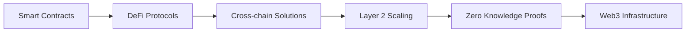

# 👋 Hello, I'm [Your Name]

<div align="center">
  
  
  
  

</div>

## 🚀 About Me

I'm a passionate **Web3 Developer** focused on building the decentralized future. I specialize in creating innovative blockchain solutions, smart contracts, and DeFi applications that push the boundaries of what's possible in the decentralized ecosystem.

- 🔭 Currently working on **[Your Current Project]**
- 🌱 Learning **[New Technology/Protocol]**
- 👯 Looking to collaborate on **Web3 projects**
- 💬 Ask me about **Blockchain, Smart Contracts, DeFi**
- 📫 Reach me at **[your.email@example.com]**

## 🛠️ Tech Stack

### Blockchain & Web3
```
Solidity • Rust • Move • Cairo
Ethereum • Polygon • Arbitrum • Optimism
Hardhat • Foundry • Truffle • Remix
Web3.js • Ethers.js • Viem • Wagmi
```

### Frontend Development
```
React • Next.js • TypeScript • JavaScript
Tailwind CSS • Styled Components • Shadcn  
```

### Backend & Infrastructure
```
Rust • Actix-Web Node.js • Express • GraphQL
Docker • AWS • Vercel
```

## 📊 GitHub Stats

<div align="center">
  
  
  
  

</div>

## 🏆 Featured Projects

### 🔥 [Project Name 1](https://github.com/yourusername/project1)
> **DeFi Protocol** - A decentralized lending platform built on Ethereum
- **Tech Stack:** Solidity, React, Hardhat, The Graph
- **Features:** Lending, Borrowing, Yield Farming
- ⭐ 150+ stars | 🍴 45 forks

### 🌟 [Project Name 2](https://github.com/yourusername/project2)
> **NFT Marketplace** - Full-stack NFT trading platform with advanced features
- **Tech Stack:** Next.js, Solidity, IPFS, Polygon
- **Features:** Minting, Trading, Royalties, Auctions
- ⭐ 200+ stars | 🍴 60 forks

### 💎 [Project Name 3](https://github.com/yourusername/project3)
> **Cross-chain Bridge** - Secure asset transfer between multiple blockchains
- **Tech Stack:** Rust, TypeScript, Cosmos SDK
- **Features:** Multi-chain support, Low fees, Fast transfers
- ⭐ 100+ stars | 🍴 30 forks

## 🎯 Current Focus



## 📈 Contribution Activity


## 🌐 Connect With Me

<div align="center">

[](https://twitter.com/yourusername)
[](https://linkedin.com/in/yourusername)
[](https://discord.gg/yourusername)
[](https://t.me/yourusername)

</div>

<div align="center">
  
  **"Building the decentralized future, one block at a time"** 🚀
  
  

</div>
```
