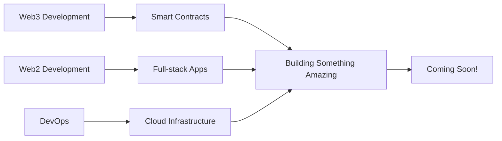

# 👋 Hello, I'm Yogesh

<div align="center">
  
  
  
  
  

</div>

## 🚀 About Me

I'm a passionate **Full-Stack Developer** with expertise spanning **Web3**, **Web2**, and **DevOps**. I love building innovative solutions across the entire technology spectrum - from decentralized applications and smart contracts to modern web applications and scalable infrastructure.

- 🔭 Currently building **something exciting** (coming soon!)
- 🌱 Always learning and exploring new technologies
- 👯 Looking to collaborate on **Web3, Web2, and DevOps projects**
- 💬 Ask me about **Blockchain, Web Development, DevOps, Cloud Infrastructure**
- 📫 Reach me at **[khutwadyogesh34@gmail.com]**

## 🛠️ Tech Stack

### Blockchain & Web3
```
Solidity • Rust • Ethereum • Polygon 
Hardhat • Foundry • Remix • Arbitrum 
Web3.js • Ethers.js • Viem • Wagmi
```

### Web Development
```
React • Next.js • Vue.js • Angular
TypeScript • JavaScript • Python • Node.js
Express • FastAPI • Django • Flask
Tailwind CSS • Styled Components • SCSS
```

### DevOps & Infrastructure
```
Docker • Kubernetes • Jenkins • GitHub Actions
AWS • Azure • GCP • Vercel • Netlify
Linux • Bash • CI/CD • Microservices
```

### Databases & Tools
```
PostgreSQL • MongoDB • Redis • MySQL
Git • Docker • Postman • Figma
```

## 🏆 Featured Projects

### 🔥 [Bitcoin Whitepaper Explanation](https://bitcoin-whitepaper-exp.vercel.app/)
> **Educational Web App** - Interactive explanation of Satoshi Nakamoto's Bitcoin whitepaper
- **Tech Stack:** Next.js, React, TypeScript, Tailwind CSS
- **Features:** Interactive sections, Visual explanations, Modern UI/UX
- 📚 Making Bitcoin accessible to everyone

### 🚧 [Current Project - Coming Soon!](https://github.com/yourusername)
> **Exciting New Build** - Something amazing is in the works...
- **Status:** 🔨 Under Development
- **Tech Stack:** Will be revealed soon
- **Features:** Stay tuned for updates!
- 🎯 Can't wait to share this with the community

### 💡 [More Projects Coming Soon](https://github.com/yourusername)
> **Portfolio Expansion** - Working on several exciting projects
- **Focus Areas:** Web3 DApps, Full-stack Applications, DevOps Tools
- **Technologies:** Modern tech stack across all domains
- 🚀 Building the future, one project at a time

## 🎯 Current Focus



## 🌟 Skills & Expertise

### 🔗 **Web3 & Blockchain**
- Smart Contract Development (Solidity, Rust)
- DeFi Protocol Design
- NFT Marketplaces
- Cross-chain Solutions

### 🌐 **Web Development**
- Full-stack Applications
- RESTful APIs & GraphQL
- Responsive Design
- Performance Optimization

### ⚙️ **DevOps & Infrastructure**
- Container Orchestration
- CI/CD Pipelines
- Cloud Architecture
- Monitoring & Logging

## 🌐 Connect With Me

<div align="center">

[](https://twitter.com/yogeshk34)
[](https://linkedin.com/in/yogesh-khutwad-0178b3250)
[](https://discord.gg/yogeshk0616)
[](https://bento.me/yogesh-khutwad)

</div>
